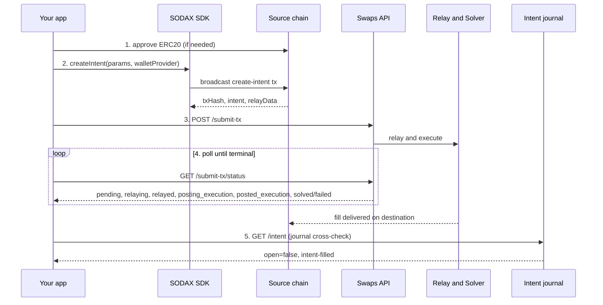

# Swap Intent Sender

A runnable **reference client for the SODAX swaps API** — clone it, run it, and read it as a canonical example of how to build, submit, and track a cross-chain swap intent.

## What is SODAX?

[SODAX](https://sodax.com) is a cross-network execution layer for on-chain money — it lets assets move, swap, and settle across many networks through a single intent-based flow. You express _what_ you want (swap token X on chain A for token Y on chain B); SODAX relays the intent to its hub chain, a solver fills it, and the output is delivered on the destination chain. Full docs: **[docs.sodax.com](https://docs.sodax.com)**.

This repo demonstrates the swap path end-to-end against the **swaps** backend:

1. build an intent with `@sodax/sdk` and broadcast it on-chain,
2. `POST /v1/swaps/submit-tx` to trigger relay + solver execution,
3. poll `GET /v1/swaps/submit-tx/status` to a terminal state (`solved` / `failed`),
4. confirm independently on-chain via the intent journal.

Submission is keyed by `srcChainKey` (a SODAX `SpokeChainKey` such as `sonic` or `0xa4b1.arbitrum`).

> 📖 **Building a bot against the swaps endpoint?** Read [`INSTRUCTIONS.md`](./INSTRUCTIONS.md) — a concise integration guide with exact payload/response shapes and operational gotchas.

> 🤖 **Using Claude Code?** This repo ships an `.mcp.json` and a `CLAUDE.md` so `claude` can answer SODAX integration questions and drive these scripts for you. See [Using Claude Code with this repo](#using-claude-code-with-this-repo).

It also includes a **chain hop** demo that moves funds across 11 EVM chains using the SDK.

## ⚠️ This spends real funds on mainnet

Every command here signs and broadcasts **real transactions on mainnet** and moves **real funds** — there is no testnet mode.

- Use a **throwaway wallet** funded with only the small amount you intend to swap.
- **Never** use a private key that holds significant funds.
- `.env` is gitignored — keep your key out of version control, and never paste it anywhere.

## Prerequisites

- Node.js >= 18
- pnpm
- `@sodax/sdk` v2 (pinned in `package.json` — installed by `pnpm install`)
- A funded EVM wallet (see the warning above)

## Setup

```bash
pnpm install
cp .env.example .env
# Edit .env: set PRIVATE_KEY to a throwaway wallet.
# API endpoints default to the public production gateway — no change needed.
```

## Environment Variables

See `.env.example` for all available variables. Key ones:

| Variable | Required | Description |
|---|---|---|
| `PRIVATE_KEY` | Yes | Wallet private key |
| `BACKEND_SWAP_ENDPOINT` | No | Swaps base URL for `submit-tx` + primary status poll (default: `https://api.sodax.com/v1/swaps`) |
| `INTENT_API_ENDPOINT` | No | apps/api base URL for the journal cross-check (default: `https://api.sodax.com/v1/be`, the public gateway prefix) |
| `JOURNAL_CROSSCHECK_TIMEOUT_MS` | No | Max wait for the journal to catch up during the cross-check (default: `90000`; a timeout is logged as inconclusive, never fatal) |
| `INPUT_AMOUNT_HUMAN` | No | Swap amount in human units (default: `1`) |
| `MIN_OUTPUT_SLIPPAGE_BPS` | No | Slippage in basis points (default: `500` = 5%) |
| `AUTO_APPROVE` | No | Auto-approve ERC20 spending (default: `true`) |
| `POLL_INTERVAL_MS` | No | Status poll interval (default: `3000`) |
| `POLL_TIMEOUT_MS` | No | Status poll timeout (default: `120000`) |
| `DISABLED_CHAINS` | No | JSON array of chain keys to skip (e.g., `["optimism","redbelly"]`) |
| `<CHAIN>_RPC_URL` | No | RPC override per chain (e.g., `BASE_RPC_URL`) |
| `LEVERAGE_YIELD_ENDPOINT` | Only for `pnpm leverage:*` | Base URL for the `/leverage-yield/*` routes. **A raw origin with no `/v1` prefix** — these routes are not fronted by the public gateway yet, so paths sit directly on the origin. Ask the SODAX team for the origin; the other `LEVERAGE_*` knobs are documented in `.env.example`. |

## Scripts

### Swap (Sonic same-chain)

| Command | Description |
|---|---|
| `pnpm start` | Full flow: approve → create → submit → poll (USDT→USDC) |
| `pnpm sonic-usdt-to-usdc` | Same as start |
| `pnpm sonic-usdc-to-usdt` | Full flow for USDC→USDT |
| `pnpm cancel <intentId>` | Cancel a pending (open) intent created by this wallet |

### Cancel a pending intent

```bash
pnpm cancel 30003198628197127137637480263704227607279888124613254871517565769320775527350
```

Resolves the `intentId` to its full `Intent` struct via the journal (`GET {INTENT_API_ENDPOINT}/intent/user/:wallet`, scanning the wallet's latest ~100 intents), derives the source chain from the intent's relay chain id, then broadcasts the cancel via `sodax.swaps.cancelIntent` and confirms the on-chain `intent-cancelled` in the journal. Only the **creator** can cancel, so it must run with the same `PRIVATE_KEY` that created the intent. If the intent is already filled/cancelled (`open: false`) it reports that and exits without sending a tx.

### Chain Hop — Forward

| Command | Description |
|---|---|
| `pnpm chain-hop` | Run all 11 forward hops sequentially |
| `pnpm hop-sonic-to-base` | USDT(Sonic) → ETH(Base) |
| `pnpm hop-base-to-optimism` | ETH(Base) → ETH(Optimism) |
| `pnpm hop-optimism-to-arbitrum` | ETH(Optimism) → ETH(Arbitrum) |
| `pnpm hop-arbitrum-to-avalanche` | ETH(Arbitrum) → AVAX(Avalanche) |
| `pnpm hop-avalanche-to-bsc` | AVAX(Avalanche) → BNB(BSC) |
| `pnpm hop-bsc-to-polygon` | BNB(BSC) → POL(Polygon) |
| `pnpm hop-polygon-to-ethereum` | POL(Polygon) → ETH(Ethereum) |
| `pnpm hop-ethereum-to-hyper` | ETH(Ethereum) → HYPE(Hyperliquid) |
| `pnpm hop-hyper-to-lightlink` | HYPE(Hyperliquid) → ETH(LightLink) |
| `pnpm hop-lightlink-to-redbelly` | ETH(LightLink) → RBNT(Redbelly) |
| `pnpm hop-redbelly-to-kaia` | RBNT(Redbelly) → KAIA(Kaia) |

### Chain Hop — Return (back to USDT on Sonic)

| Command | Description |
|---|---|
| `pnpm hop-base-to-sonic` | ETH(Base) → USDT(Sonic) |
| `pnpm hop-optimism-to-sonic` | ETH(Optimism) → USDT(Sonic) |
| `pnpm hop-arbitrum-to-sonic` | ETH(Arbitrum) → USDT(Sonic) |
| `pnpm hop-avalanche-to-sonic` | AVAX(Avalanche) → USDT(Sonic) |
| `pnpm hop-bsc-to-sonic` | BNB(BSC) → USDT(Sonic) |
| `pnpm hop-polygon-to-sonic` | POL(Polygon) → USDT(Sonic) |
| `pnpm hop-ethereum-to-sonic` | ETH(Ethereum) → USDT(Sonic) |
| `pnpm hop-hyper-to-sonic` | HYPE(Hyperliquid) → USDT(Sonic) |
| `pnpm hop-lightlink-to-sonic` | ETH(LightLink) → USDT(Sonic) |
| `pnpm hop-redbelly-to-sonic` | RBNT(Redbelly) → USDT(Sonic) |
| `pnpm hop-kaia-to-sonic` | KAIA(Kaia) → USDT(Sonic) |

### Leverage Yield (vault deposit / withdraw)

The Leverage Yield API lets you swap any supported token into a leveraged LSD vault position
(`lsoda*` shares, 18 decimals) and back out again. It is a **separate API surface** from swaps:
the backend builds every unsigned transaction and hands it back, so the client is plain `fetch`
plus local signing — no SDK leverage module is used here.

| Command | Description |
|---|---|
| `pnpm leverage:vaults` | **Read-only.** Lists vaults, quotes both directions, shows your derived hub wallet + share position, and asserts the malformed-vault `400`. Spends nothing. |
| `pnpm leverage:deposit` | Leg 1 — spoke token → `lsoda*` shares. **Spends real funds.** |
| `pnpm leverage:withdraw` | Leg 2 — `lsoda*` shares → token. **Spends real funds.** |
| `pnpm leverage:round-trip` | Both legs back to back. **Spends real funds.** |

Requires `LEVERAGE_YIELD_ENDPOINT` (see Environment Variables). Start with `pnpm leverage:vaults`.

Flow per leg — `POST /leverage-yield/quote/{deposit,withdraw}` → `POST /leverage-yield/intents/{deposit,withdraw}`
→ sign and broadcast the returned `tx` on `srcChainKey` → `POST /leverage-yield/submit-tx` (with
`operation: "deposit" | "withdraw"`) → poll `GET /leverage-yield/submit-tx/status` to `solved` / `failed`.
Deposits add an `allowance/check` → `approve` step; **withdrawals have no approve step** — the shares
live in your derived hub wallet and the backend bundles that approval itself.

Things worth knowing:

- **Shares are owned by your derived hub wallet, not your EOA.** `share-balance` / `max-withdraw` take
  that address as `owner`; the script reads it from `intent.creator` in the create-intent response.
- **That hub wallet is per source spoke.** The same EOA gets a different hub wallet for each
  `srcChainKey`, so **shares deposited from one chain cannot be withdrawn from another** — deposit and
  withdraw with the same `LEVERAGE_SRC_CHAIN_KEY`. Withdrawing from a spoke with no shares returns a
  `422`, so check `pnpm leverage:vaults` (which reports the position) first.
- **`max-withdraw` returns the raw on-chain value, not dust-trimmed.** Feeding it back verbatim can trip
  the vault's share round-up and revert, so a small buffer (`LEVERAGE_WITHDRAW_BUFFER_BPS`) is subtracted.
  It can also sit well below your `share-balance` (the leveraged position caps it), so **a single
  withdraw won't fully exit a vault** — expect leftover shares and repeat if you want out completely.
- Quotes are never passed through verbatim — `minOutputAmount` is the quote minus `LEVERAGE_SLIPPAGE_BPS`.
- `deadline` defaults to hub block time + 5 minutes if omitted; the script sends an explicit, longer one.
- Leverage withdrawals cannot carry a `partnerFee` (deposits can) — see `icon-project/sodax-sdks#325`.
- Each run writes a `leverage-yield-proof-*.{txt,json}` report (gitignored) with the source tx hash and
  the full final status response per leg. The report **redacts the origin**; console output does not, so
  paste the report rather than raw console logs.

### Utilities

| Command | Description |
|---|---|
| `pnpm balances` | Show native balance on every chain + USDT on Sonic |
| `pnpm sweep` | Swap all remote native balances back to USDT on Sonic |

### Dev

| Command | Description |
|---|---|
| `pnpm checkTs` | Type-check without emitting |
| `pnpm format` | Prettier format all .ts/.json files |
| `pnpm format:check` | Check formatting |

## Architecture



_Endpoints — Swaps API: `https://api.sodax.com/v1/swaps` · Intent journal: `https://api.sodax.com/v1/be` (public gateway prefix)._

**Terminal status:** `solved` = success, `failed` = failure. (`solved` was renamed from `executed` in a 2026 SODAX SDK rename; a client must not wait for a `solved → executed` transition — there isn't one. `executed` now appears only as `result.packetData.status`.)

1. **Approve** ERC20 token spending (if needed; spender = the SDK's intents contract)
2. **Create intent** — `sodax.swaps.createIntent({ params, walletProvider })` builds and broadcasts the create-intent tx, returning `{ tx, intent, relayData }` (the SDK fills in the relay chain ids and relay data, so there is no manual receipt decode)
3. **Submit** `{ txHash, srcChainKey, walletAddress, intent, relayData }` to `POST /v1/swaps/submit-tx` (triggers the relay + solver execution)
4. **Poll status (primary)** — `GET /v1/swaps/submit-tx/status?txHash=…&srcChainKey=…` until terminal (`solved` / `failed`). This is the swaps-api's own pipeline view: `pending → relaying → relayed → posting_execution → posted_execution → solved | failed`, with `failedAtStep` / `failureReason` / `userMessage` / `intentCancelled` on failure. **`solved` is the terminal success state** (renamed from `executed` in a 2026 SODAX SDK rename); `executed` now appears only as `result.packetData.status`.
5. **Cross-check the intent journal (apps/api)** for independent on-chain confirmation:
   - same-chain (Sonic source): `GET {INTENT_API_ENDPOINT}/intent/tx/:txHash` — the broadcast tx is the hub intent tx, so this is instance-precise
   - cross-chain: `GET {INTENT_API_ENDPOINT}/intent/:intentHash` (`intentHash = sodax.swaps.getIntentHash(intent)`) — the broadcast tx is on a spoke chain, while the journal is keyed by the hub tx

**Why both:** `submit-tx/status` is the primary signal (exact `(txHash, srcChainKey)` keying, and it reports *why* a swap failed — the journal can't, and for cross-chain a relay failure means nothing ever lands in the journal). The journal is independent on-chain ground truth, so it guards against the circularity of trusting the swaps-api's own self-report. Journal lifecycle: `404` (not yet observed on-chain) → `open: true` → `open: false` (terminal `intent-filled` / `intent-cancelled`); `packetData` carries the cross-chain delivery proof. The cross-check is soft — if the aggregator lags past `JOURNAL_CROSSCHECK_TIMEOUT_MS` it's logged as inconclusive, never fatal. The journal is on-chain-derived, so it is identical across all deployments.

## Chain Hop Sequence

```
Sonic(USDT) → Base(ETH) → Optimism(ETH) → Arbitrum(ETH) → Avalanche(AVAX)
  → BSC(BNB) → Polygon(POL) → Ethereum(ETH) → Hyperliquid(HYPE)
  → LightLink(ETH) → Redbelly(RBNT) → Kaia(KAIA)
```

Chains can be skipped at runtime via `DISABLED_CHAINS`. The hop sequence auto-rewires around disabled chains (e.g., disabling `optimism` makes Base hop directly to Arbitrum).

## Using Claude Code with this repo

This repo is set up so that [Claude Code](https://claude.com/claude-code) can help you integrate SODAX. After cloning, just run `claude` in the repo directory.

- **`CLAUDE.md`** gives Claude the project context — the swaps flow, the API contract, and safety guardrails.
- **`.mcp.json`** registers the public **SODAX Builders MCP** server (`https://builders.sodax.com/sse`). On first run Claude Code will ask you to approve it; once enabled, Claude can pull **live** SODAX data — supported chains and tokens, solver quotes, the orderbook, config — and search the docs, instead of guessing.

Things you can ask Claude in this repo:

- _"What chains and tokens can I swap between on SODAX?"_ (answered from live config)
- _"Quote me 100 USDT from Sonic to USDC on Arbitrum."_
- _"Walk me through what `main.ts` does, step by step."_
- _"Run the USDT→USDC swap and explain each step as it happens."_
- _"My intent is stuck at `solved` — did it actually fill?"_

> Claude will run on-chain, fund-spending commands only with your confirmation. Keep your `.env` private — never ask Claude (or anyone) to print your private key.

## Troubleshooting

| Symptom | Cause / fix |
|---|---|
| Status never leaves `solved` | `solved` **is** the terminal success state (renamed from `executed`). Treat `solved`/`failed` as terminal; don't wait for `executed`. |
| `route_not_found` / 404 on submit | You hit the retired `/v1/bes/swaps/*` path. Use `/v1/swaps` (`BACKEND_SWAP_ENDPOINT`). |
| `Insufficient balance` right after a run | Read balances from a fresh, in-sync RPC — a lagging node returns stale balances. Override with `<CHAIN>_RPC_URL`. |
| Journal cross-check "inconclusive" | The aggregator can lag the swaps-api by a few blocks; this is soft and never fails the run. Raise `JOURNAL_CROSSCHECK_TIMEOUT_MS` if needed. |
| `429 Too Many Requests` on submit | `submit-tx` is throttled ~10/min/IP. Back off and retry — it's idempotent on `(txHash, srcChainKey)`. |
| Cross-chain funds slow to arrive | Hub→spoke delivery can lag the `solved` status by minutes; poll the destination balance with a generous timeout. |
| `400 vault must be an Ethereum address` | A `leverage-yield` request had a malformed `vault`. Take the address from `GET /leverage-yield/vaults`. |
| Leverage `share-balance` returns `0` after a successful deposit | You queried your EOA. The `owner` is your **derived hub wallet** — read it from `intent.creator` in the create-intent response. |
| Leverage withdraw reverts on-chain | `max-withdraw` is the raw, non-dust-trimmed value; the vault's share round-up can push it over. Raise `LEVERAGE_WITHDRAW_BUFFER_BPS`. |

## Links & support

- Docs: **[docs.sodax.com](https://docs.sodax.com)**
- Website: **[sodax.com](https://sodax.com)**
- Integration guide: [`INSTRUCTIONS.md`](./INSTRUCTIONS.md)
- Issues: open a GitHub issue on this repo.
